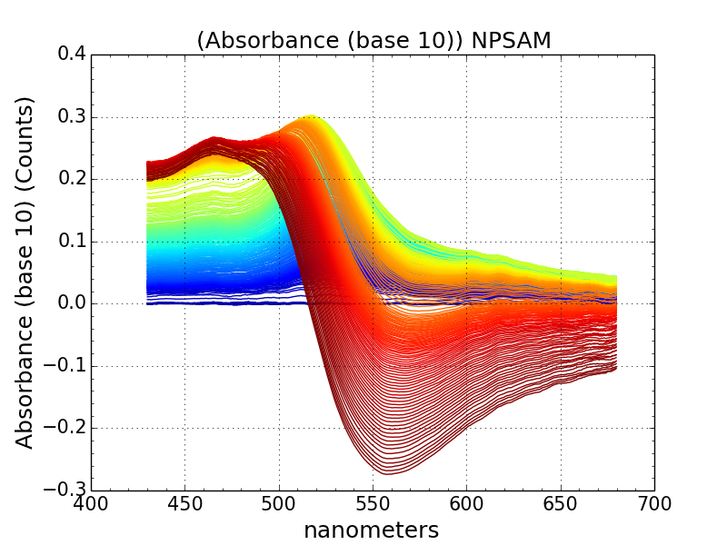

==========
What's New
==========
   - Just released 0.2

===========================================
pyuvvis: Tools for explorative spectroscopy
===========================================

Getting Started
===============

The current documentation (and in-a-pinch test suite) is a series of example notebooks 
(`iPython Notebook`_), which cover most of the basics. These have been linked below:

   .. _`iPython Notebook`: http://ipython.org/notebook.html?utm_content=buffer83c2c&utm_source=buffer&utm_medium=twitter&utm_campaign=Buffer

- **TUTORIALS**:
   - `TimeSpectra tutorial (part 1)`_
   - `TimeSpectra tutorial (part 2)`_
   - `Sampling and Selecting Data`_
   - `IO: Importing and Exporting`_
   - `Intro to Plotting`_
   - `Intro to 2D and 3D Plots`_
   - `Interactive Plots with Plotly`_
   - `Pre-packaged Datasets`_
   - `Intro to Multiple Datasets (StackSpec)`_

   .. _`Sampling and Selecting Data` : http://nbviewer.ipython.org/github/hugadams/pyuvvis/blob/master/examples/Notebooks/slicing.ipynb?create=1
   .. _`IO: Importing and Exporting` :   http://nbviewer.ipython.org/github/hugadams/pyuvvis/blob/master/examples/Notebooks/io.ipynb?create=1
   .. _`Intro to Plotting` :   http://nbviewer.ipython.org/github/hugadams/pyuvvis/blob/master/examples/Notebooks/Plotting.ipynb?create=1
   .. _`Intro to 2D and 3D Plots` :   http://nbviewer.ipython.org/github/hugadams/pyuvvis/blob/master/examples/Notebooks/plotting_2d3d.ipynb?create=1
   .. _`Interactive Plots with Plotly` :   http://nbviewer.ipython.org/github/hugadams/pyuvvis/blob/master/examples/Notebooks/plotly.ipynb?create=1
   .. _`Pre-packaged Datasets` :   http://nbviewer.ipython.org/github/hugadams/pyuvvis/blob/master/examples/Notebooks/testdata.ipynb?create=1
   .. _`Intro to Multiple Datasets (StackSpec)` :   http://nbviewer.ipython.org/github/hugadams/pyuvvis/blob/master/examples/Notebooks/specstack.ipynb?create=1
   .. _`TimeSpectra tutorial (part 1)` :   http://nbviewer.ipython.org/github/hugadams/pyuvvis/blob/master/examples/Notebooks/tutorial_1.ipynb?create=1
   .. _`TimeSpectra tutorial (part 2)` :   http://nbviewer.ipython.org/github/hugadams/pyuvvis/blob/master/examples/Notebooks/tutorial_2.ipynb?create=1

- **RESEARCH APPLICATIONS**:
   - Correlation spectral data with electron microscopy
   -

- **SPECIAL TOPICS**:
   - Two Dimensional Correlation Spectroscopy (see `Noda/Ozaki`_)
   - Sizing Gold Nanoparticles through UVVis Spectra 
   - `Creating custom unit systems`_

   .. _`Creating custom unit systems` : http://nbviewer.ipython.org/github/hugadams/pyuvvis/blob/master/examples/Notebooks/units.ipynb

- **MISCELLANEOUS**:
   - `Matplotlib Color Maps`_

   .. _`Matplotlib Color Maps` : http://nbviewer.ipython.org/github/hugadams/pyparty/blob/master/examples/Notebooks/gwu_maps.ipynb?create=1
   .. _`Noda/Ozaki` : http://science.kwansei.ac.jp/~ozaki/NIR2DCorl_e.html

Legacy documentation_ is generously hosted by github_.

   .. _github: http://github.com
 
   .. _documentation: http://hugadams.github.com/pyuvvis/

License
=======

3-Clause Revised BSD_

   .. _BSD : https://github.com/hugadams/pyuvvis/blob/master/LICENSE.txt

Installation
============

Dependencies
------------
In its current state, pyuvvis requires following dependencies:

**pandas (0.14 or greater)**, **scipy**

.. _scipy: http://www.scipy.org

I would recommend using `Enthought Canopy`_ and its excellent
the package manager.  ``pyuvvis`` is also 
registered on PyPi_.

   .. _PyPi : https://pypi.python.org/pypi/PyUvVis

   .. _`Enthought Canopy` : https://www.enthought.com/products/canopy/

Pip Install
-----------

Make sure you have pip installed:

    sudo apt-get install python-pip
    
Then:
   
    pip install pyuvvis
    
To install all of the dependencies, download ``pyuvvis`` from github, navigate
to the base directory and type:

    pip install -r requirements.txt

Installation from source
------------------------

In the ``pyuvvis`` base directory run:

    python setup.py install

The developmental version can be cloned from github:

    git clone https://github.com/hugadams/pyuvvis.git
    
This will not install any dependencies.

Download the source_ and run::

   python setup.py install

This should install to your systems default Python path.  If your default Python path is not found, or you have multiple Python distributions,
install to an arbitrary directory using the home keyword option::

   python setup.py install 
  
.. _source: https://github.com/hugadams/pyuvvis

To install all of the dependencies (pandas, scipy and their various dependencies), download ``pyuvvis`` from github, navigate
to the base directory and type:

    pip install -r requirements.txt

Testing Installation
--------------------

Open a Python shell and run the following::

   from pyuvvis import *

   from pyuvvis.data import *

This should result in no errors.  

History and Background
========================

``pyuvvis`` originally began at the George Washington University in an 
effort to develop exploratory visualization techniques with UVVis
data, particularly the output of fiberoptic/nanotechnology research. 

The decision to officialy package these nascent tools was made for the following 
reasons:
 
   1. To faciliate easier sharing and better organization between collaborators.
   2. To document the progress and functionalities of the toolset.
   3. To broadcast the toolkit to the community, and hopefully to merge with other Python spectroscopy packages.

In regard to the final point, ``pyuvvis`` is not an attempt to be the de-facto spectroscopy
toolkit in Python; rather, it is a domain-specific wrapper for pandas.  It should be quite extensible
to other spectroscopy domains, where it may perform a supporting or ancillary role.  It is our 
hope that in the future, other internal GWU tools for fiber optics design and nanomaterial plasmonics,
combined with this package, may form the basis for a crude nano-optics Python package.

Related Libraries
=================
Interested in the Python ecosystem?   Check out some of these related libraries:

   - NumPy_ (Fundamental vectorized numerics in Python)
   - SciPy_ (Collection of core, numpy-based scientific libraries)
   - matplotlib_ (De facto static plotting in Python)
   - pandas_ (R on steroids)
   - plotly_ (Interactive/cloud plotting)

   .. _NumPy: http://www.numpy.org/
   .. _pandas: http://pandas.pydata.org/
   .. _SciPy: http://scipy.org/
   .. _matplotlib : http://matplotlib.org/
   .. _plotly : https://plot.ly/
   
Coming Soon
===========
   - Correlation Analysis Tutorial
   - Stacked Spectra Tutorial
   
   
Have a feature request, or want to report a bug?  Please fill out a github
issue_ with the appropriate label.	

.. _issue : https://github.com/hugadams/pyuvvis/issues

About the Author
================

I'm a PhD student at GWU (check me out on researchgate_, Linkedin_ or twitter_(@hughesadam87))
and former Enthought intern. I work in biomolecule sensing and nanophotonics.  
Like any PhD student, my time is stretched across many projects.  As such,
the ``pyuvvis`` source code may is messy in places, and a test suite has
yet to be developed.  Developing the iPython notebook tutorials 
alongside the code helped served as a basic regression test platform.  

   .. _researchgate : https://www.researchgate.net/profile/Adam_Hughes2/?ev=hdr_xprf
   .. _Linkedin : http://www.linkedin.com/profile/view?id=121484744&goback=%2Enmp_*1_*1_*1_*1_*1_*1_*1_*1_*1_*1_*1&trk=spm_pic
   .. _twitter : https://twitter.com/hughesadam87

Acknowledgements
================
Thank you countless developers who have patiently answered hundreds of 
my questions on too many mailing lists and sites to list.

Thank you `Zhaowen Liu`_ for all of your help with this project, our 
other projects and for your unwaivering encouragement (and for the panda).

    .. _`Zhaowen Liu` : https://github.com/EvelynLiu77
